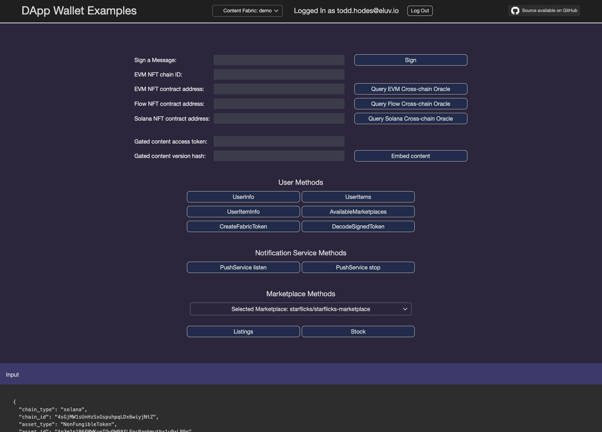

# Eluvio DApp Sample

## DApp Wallet Examples

This repository illustrates how to develop for the Eluvio Content Fabric CDN and Marketplace,
specifically via an Eluvio Content Fabric crypto wallet and its associated libraries.

A version of this app is hosted for your convenience at
[https://dapp-sample.app.eluv.io/](https://dapp-sample.app.eluv.io/).

This DApp is built atop the [Eluvio Media Wallet](https://github.com/eluv-io/elv-media-wallet)
library, and the underlying [Eluvio JS Client Library](https://github.com/eluv-io/elv-client-js).

The library is used for login, retrieving information about the user's assets,
signing, and Marketplace access. Operations highlighted by this sample:
- User methods: calls that get info on the currently logged-in user
- Marketplace methods: calls that get info on the marketplaces for primary and secondary sales
- NFT ownership validation:
  - Use a cross-chain oracle query to check for ownership on an EVM blockchain (Eluvio, mainnet, polkadot, or any other)
  - Use a cross-chain oracle query to check for ownership on the flow blockchain
  - Use a cross-chain oracle query to check for ownership on the solana blockchain
- Embed token-gated content: simplify the embedding of fabric-hosted DRM video in an `<iframe>`

The library is documented here:
[Eluvio Wallet Client Documentation](https://eluv-io.github.io/elv-client-js/wallet-client/index.html).
For information about implementing other login options using the wallet and/or frame client, please see
[Login Samples](https://core.test.contentfabric.io/elv-media-wallet-client-test/test-login/).

Furthermore, cross-chain features are available through the Eluvio Javascript Client, documented here:
[Eluvio Javascript Client Documentation](https://eluv-io.github.io/elv-client-js/index.html).
For information on setting such cross-chain policies, see [README.policy.md](README.policy.md).
This operation requires use of the `elv-live` CLI tool [elv-live-js](https://github.com/eluv-io/elv-live-js).

## Setup

To run this sample:
- clone this repo
- run `npm install`
- run `npm run serve-wallet-ops-test`
- open your browser to [https://localhost:8094](https://localhost:8094)

The matching source code for the sample is in the `test/wallet-ops` subdirectory.  It was built atop a clone
of the wallet client, and that code remains in the main `src/` directory for reference.
There are other samples alongside it in the `test/` directory, feel free to run and reference them, too.

## DApp Cross-chain app branch

Notes for site-sample-style crossover cross-chain app

Management scripts are in `~todd/ops/policy/starflix-demo/` will check in later.

### CF Playable Assets

network: demov3
user: starflicks-elv-admin

"name": "Tears of Steel ",
"hash": "hq__8RBeZSEeZKGRucRNFDFN6Td3SgS71Yq2Lz5k4bf773HabL2B22DKxkxWGELPX2kEUQjgBG4wRc",
"objectId": "iq__3SpYjqE2gsMkbKtxaLA1HB1Pb6Mg",

"name": "Meridian ",
"hash": "hq__BJ4ury6zXvHv4tG4FndgqynDR15ejEwQyeN1sojDvygqtzsfNmpkZnWLvkyfRBHBKFQoCyS53s",
"objectId": "iq__2b7yLgWuVRZKyFXdew7kbSCu5deD",

"name": "Caminandes - Ep 1 ",
"hash": "hq__9xS9V4VpFp9xN9rAQdjD3q1hTWGGz2RpCj9MBTSQaR1nuWrPjpCdxVe1onXTTtg921w8oQxnMK",
"objectId": "iq__xGNmhvgxi6Nrc9M4kgekXPQgiiZ",

"name": "Caminandes - Ep 2 ",
"hash": "hq__2wgaPpzjcRUJsctv7YcjGdqyG6GnuEdtS2fwnFNprQFLCia7XywQ98E57aMNqckUcEgaiQHYwf",
"objectId": "iq__fPwqqp139xqLxApiyt6hoSgu3zm",

"name": "Caminandes - Ep 3 ",
"hash": "hq__KHcKw9YUgR72p1vcYeGHAAd7L9XMHr5QPXnepbSBibhZMQTBpz3DDVHUCrtCTmwyqVvDNhLDcg",
"objectId": "iq__2QaBrtbffYaopCLGzU5tXpTHeTfn",

### Owners

eluvio: todd.hodes@eluvio.io
- Starflix Tears of Steel - via ownership of 0x43842733179fa1c38560a44f1d9067677461c8ca
- link?
 
eluvio: todd.hodes@eluvio.io
- Starflix Meridian single-movie - via ownership of 0x5755ceaa00991d223853f34a9fbc0ae0a5f683d9
- https://media-wallet-dv3.dev.app.eluv.io/#/marketplace/iq__2GReTbzD3TM4pXigx6XzNwPCRk5P/store/Hn5JScGHxJDrCG2VVK485v

metamask: serban-acct: 0xcD8323Da264E9C599AF47A0D559DcDCB335D44aB
- Starflicks 'All Access' 0x250d641f36bf16c34467d6533542f96e23c6f2bd
- https://eluvio.tryethernal.com/nft/0x250d641f36bf16c34467d6533542f96e23c6f2bd?tab=transactions
- https://media-wallet-dv3.dev.app.eluv.io/#/marketplace/iq__2GReTbzD3TM4pXigx6XzNwPCRk5P/store/5Zb7yp4sHjkjr3UZChy4z7

solana: Loren Wallet
- owns Meridian  via ownership of Ag3m1p1B6FMWKunTQwDW98fLEpcPaobmuthx1u9xLP9q
- https://explorer.solana.com/address/Ag3m1p1B6FMWKunTQwDW98fLEpcPaobmuthx1u9xLP9q

flow: user 0xcbd420284fd5e19b
- owns Caminandes - Ep 1 via ownership of 0x329feb3ab062d289:CNN_NFT
- https://flowscan.org/contract/A.329feb3ab062d289.CNN_NFT
 
ethereum mainnet metamask serban-acct: 0xcD8323Da264E9C599AF47A0D559DcDCB335D44aB
- owns Caminandes - Ep 2  via ownership of eth mainnet stoner cat 0xd4d871419714b778ebec2e22c7c53572b573706e
- https://dappradar.com/hub/assets/eth/0xd4d871419714b778ebec2e22c7c53572b573706e/7369

metamask: serban-acct: 0xcD8323Da264E9C599AF47A0D559DcDCB335D44aB
- owns Caminandes - Ep 3  via ownership of polygon 0xfb12a21eea1e1e8825531be2c2329ddcc5a22a7a
- https://polygonscan.com/token/0xfb12a21eea1e1e8825531be2c2329ddcc5a22a7a

owns eth     mainnet stoner cat: 0xD4d871419714B778eBec2E22C7c53572b573706e 
on ethereum  Krap Chicken  https://etherscan.io/address/0x5a57ed460bd0368bfcf48dd3dd246a56b4bbb891
on polygon   0xfb12a21eea1e1e8825531be2c2329ddcc5a22a7a 

Starflicks 'All Access' on our chain 0x250d641f36bf16c34467d6533542f96e23c6f2bd

